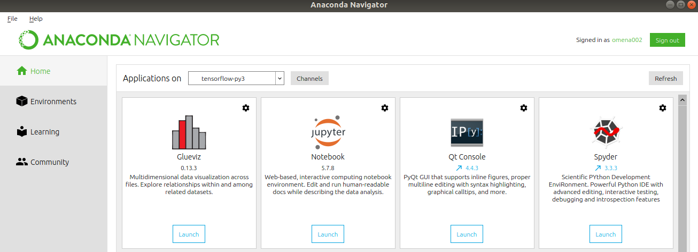
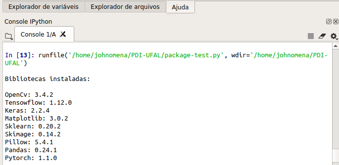
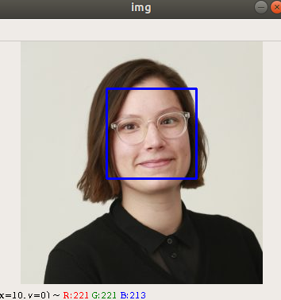
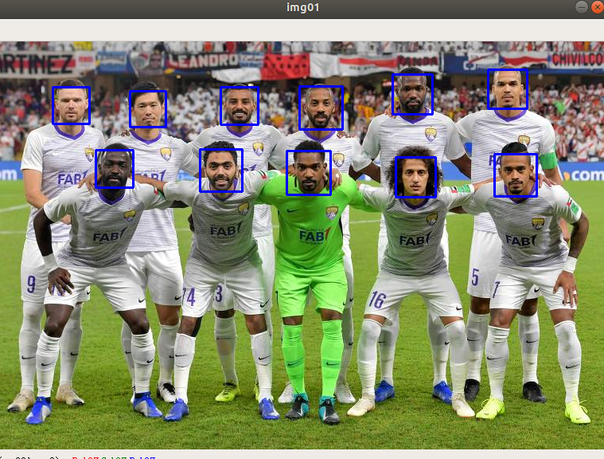
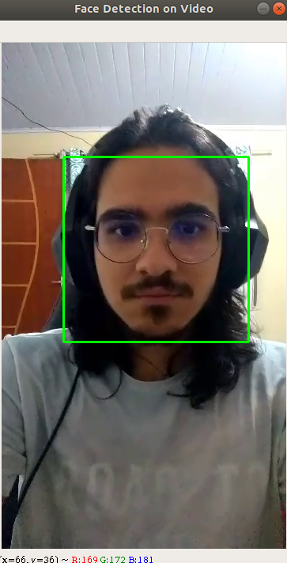
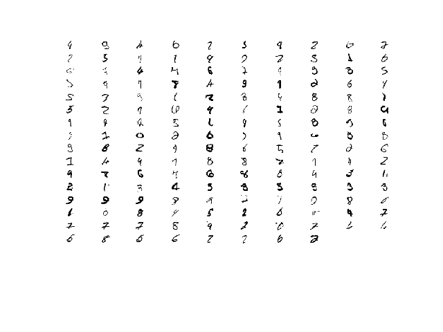

# PDI-UFAL
Repository of the digital image processing class

# T01 - Tools / Project theme

### 1. Install tools

- [x] Anaconda w. Python 3 (optional virtual environment manager).
- [x] Spyder (pycharm).
- [x] Jupyter-notebook.
- [x] opencv, tensorflow, keras, matplotlib, scikit-learn, scikit-image, pillow, pandas, torch.

### 2. Run a test script to check if the environment is working.
### 3. Post a screenshot with the results.

### 4. Post the theme of the project you have chosen.

- [x] Image Captioning

### 5. Post your information from github.

- [x] https://github.com/JohnOmena/PDI-UFAL

# T02 - Face detection

### Detect a face in an image

### Detect multiple faces in an image

### Detect a face on video

# T03 - MINIST

### Examples of wrong classifications

